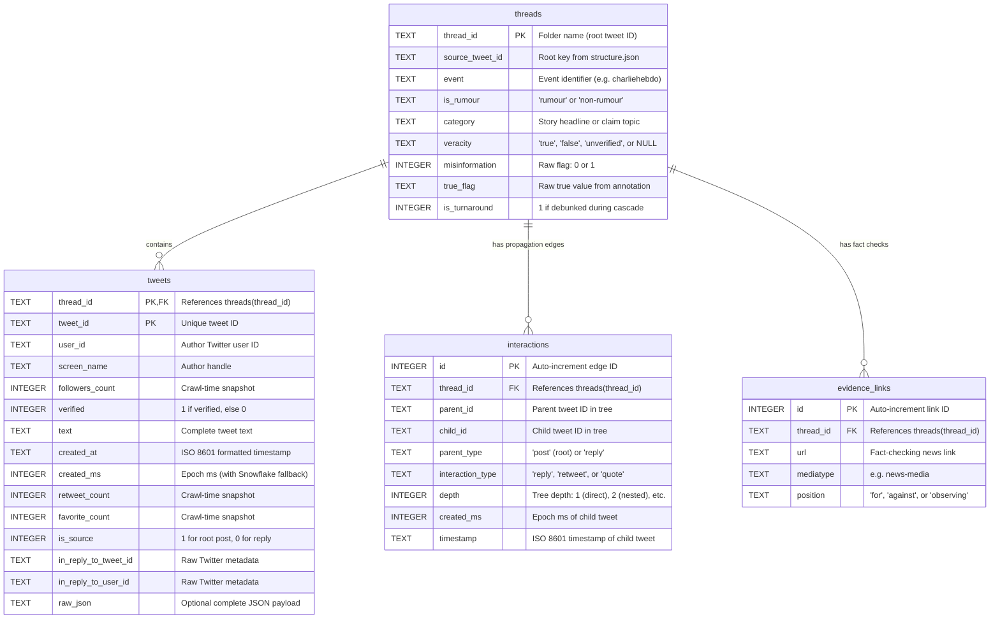

# PHEME SQLite Database Documentation

* **Database File**: `data/processed/pheme.db`
* **Schema DDL**: [src/data/schema.sql](file:///home/guru-saran/Documents/idp2026/src/data/schema.sql)
* **Rebuild Script**: [src/data/load_pheme_db.py](file:///home/guru-saran/Documents/idp2026/src/data/load_pheme_db.py)
* **Dataset Guide**: [docs/DATA_SETUP.md](file:///home/guru-saran/Documents/idp2026/docs/DATA_SETUP.md)

---

## 1. Overview & Architecture

The **PHEME SQLite Database** (`pheme.db`) consolidates **over 100,000 scattered JSON files** from the PHEME 9-event dataset into a normalized, single-file relational database. It serves as the primary data store for the **Q-MisinfoGuard** pipeline, feeding graph construction ([build_propagation_graph.py](file:///home/guru-saran/Documents/idp2026/src/graph/build_propagation_graph.py)), GNN spread modeling (Phase 2), and intervention optimization (Phase 3).

### Entity-Relationship Diagram



---

## 2. Table Specifications

### A. `threads`
Stores ground-truth claim metadata and veracity labels for each conversational cascade.

| Column | Type | Constraints | Description |
| :--- | :--- | :--- | :--- |
| `thread_id` | `TEXT` | `PRIMARY KEY` | Thread folder name (root tweet ID string). |
| `source_tweet_id` | `TEXT` | | Root key from `structure.json`. Accounts for upstream 64-bit integer precision loss. |
| `event` | `TEXT` | `NOT NULL` | Event code: `charliehebdo`, `ebola-essien`, `ferguson`, `germanwings-crash`, `gurlitt`, `ottawashooting`, `prince-toronto`, `putinmissing`, `sydneysiege`. |
| `is_rumour` | `TEXT` | `NOT NULL` | Categorization: `'rumour'` or `'non-rumour'`. |
| `category` | `TEXT` | | The specific rumor topic or claim headline (e.g., *"Mike Brown was shot 10 times"*). |
| `veracity` | `TEXT` | | Derived ground truth: `'true'`, `'false'`, `'unverified'`, or `NULL` (for non-rumours and contradictory annotations). |
| `misinformation` | `INTEGER` | | Raw `misinformation` flag from `annotation.json` (`0` or `1`). |
| `true_flag` | `TEXT` | | Raw `true` field from `annotation.json` (`'0'`, `'1'`, `'true'`, `'false'`, `'unverified'`). |
| `is_turnaround` | `INTEGER` | | `1` if the rumor was officially debunked/reversed during the cascade, `0` otherwise. |

#### Veracity Derivation Logic:
* Non-rumours (`is_rumour = 'non-rumour'`) $\rightarrow$ `NULL`
* Contradictory flag (`misinformation = 1` AND `true = 1`) $\rightarrow$ `NULL`
* `misinformation = 0, true = 0` $\rightarrow$ `'unverified'`
* `misinformation = 0, true = 1` $\rightarrow$ `'true'`
* `misinformation = 1, true = 0` $\rightarrow$ `'false'`

---

### B. `tweets`
Stores all individual tweets (both root source tweets and subsequent replies/reactions).

| Column | Type | Constraints | Description |
| :--- | :--- | :--- | :--- |
| `thread_id` | `TEXT` | `NOT NULL`, `FK` | Foreign key referencing `threads(thread_id)`. |
| `tweet_id` | `TEXT` | `NOT NULL` | Unique Twitter Tweet ID string. |
| `user_id` | `TEXT` | | Author's Twitter numerical user ID string. |
| `screen_name` | `TEXT` | | Author's Twitter handle (e.g. `@H_E_Samuel`). |
| `followers_count` | `INTEGER` | | Author's follower count **at the time of crawl** (static snapshot). |
| `verified` | `INTEGER` | | `1` if author held a verified badge at collection time, else `0`. |
| `text` | `TEXT` | | Full UTF-8 text of the tweet. |
| `created_at` | `TEXT` | | ISO 8601 formatted timestamp string (`YYYY-MM-DDTHH:MM:SS+00:00`). |
| `created_ms` | `INTEGER` | `NOT NULL` | Unix epoch timestamp in milliseconds. Falls back to Snowflake ID decoding. |
| `retweet_count` | `INTEGER` | | Number of retweets at collection time (static snapshot). |
| `favorite_count` | `INTEGER` | | Number of likes/favorites at collection time (static snapshot). |
| `is_source` | `INTEGER` | `NOT NULL` | `1` if this tweet is the initiating post of the thread; `0` if it is a reply. |
| `in_reply_to_tweet_id` | `TEXT` | | Raw Twitter metadata field (not used for tree propagation). |
| `in_reply_to_user_id` | `TEXT` | | Raw Twitter metadata field. |
| `raw_json` | `TEXT` | | Optional complete raw tweet JSON payload. |

**Primary Key**: `PRIMARY KEY (thread_id, tweet_id)` ensures duplicate tweets within the same thread folder are ignored during ingestion.

---

### C. `interactions`
Represents the propagation tree edges (diffusion network) derived strictly from `structure.json`.

| Column | Type | Constraints | Description |
| :--- | :--- | :--- | :--- |
| `id` | `INTEGER` | `PRIMARY KEY AUTOINCREMENT` | Unique edge ID. |
| `thread_id` | `TEXT` | `NOT NULL`, `FK` | Foreign key referencing `threads(thread_id)`. |
| `parent_id` | `TEXT` | `NOT NULL` | Parent tweet ID (the post being responded to). |
| `child_id` | `TEXT` | `NOT NULL` | Child tweet ID (the responding tweet). |
| `parent_type` | `TEXT` | | `'post'` if `parent_id` is the root tweet; `'reply'` if parent is an intermediate reply. |
| `interaction_type` | `TEXT` | `NOT NULL` | Interaction classification: `'reply'`, `'retweet'`, or `'quote'`. |
| `depth` | `INTEGER` | `NOT NULL` | Level in conversational tree: `1` (direct reply to root), `2` (reply to reply), etc. |
| `created_ms` | `INTEGER` | | Milliseconds timestamp of the child tweet (Snowflake derived if missing). |
| `timestamp` | `TEXT` | | ISO 8601 timestamp string of the child tweet. |

**Unique Constraint**: `UNIQUE(thread_id, child_id)` enforces that in a propagation tree, each child reaction has exactly one parent.

---

### D. `evidence_links`
Stores external journalistic verification URLs and stance labels from `annotation.json`.

| Column | Type | Constraints | Description |
| :--- | :--- | :--- | :--- |
| `id` | `INTEGER` | `PRIMARY KEY AUTOINCREMENT` | Unique link record ID. |
| `thread_id` | `TEXT` | `NOT NULL`, `FK` | Foreign key referencing `threads(thread_id)`. |
| `url` | `TEXT` | | Fact-checking or news article URL. |
| `mediatype` | `TEXT` | | Media classification (e.g. `'news-media'`). |
| `position` | `TEXT` | | Position towards the rumor: `'for'`, `'against'`, or `'observing'`. |

---

## 3. Helper Views

The schema includes two predefined views for rapid analytics:

### 1. `v_propagation_edges`
Joins `interactions` with author details and tweet text using `LEFT JOIN`. Even if a tweet was deleted on Twitter and has no JSON payload, the edge remains available:
```sql
SELECT * FROM v_propagation_edges WHERE thread_id = '552783238415265792';
```

### 2. `v_cascade_summary`
Aggregates cascade-level propagation metrics for every thread:
* `total_reactions`: Total number of reply/quote edges.
* `max_depth`: Deepest branching level reached.
* `duration_seconds`: Time elapsed from first to last reaction in the cascade.

---

## 4. Key Design Decisions

1. **Strict Hierarchy Source of Truth**:
   Twitter's native `in_reply_to_status_id` field often fails to capture complex conversation branching (e.g. quotes or third-party web clients). All parent-child edges are extracted exclusively from `structure.json`.
2. **Twitter Snowflake Millisecond Recovery**:
   Twitter IDs encode the creation time in the highest 41 bits:
   $$\text{created\_ms} = (\text{tweet\_id} \gg 22) + 1288834974657$$
   This ensures 100% of interaction edges have exact millisecond timestamps, even for tweets that were deleted before download.
3. **Snapshot Features vs. Propagation Features**:
   > [!WARNING]
   > `followers_count`, `retweet_count`, and `favorite_count` reflect counts **when the crawler downloaded the data**, not when the tweet was posted. They must **not** be used as dynamic features of cascade evolution. Rely on `depth` and `created_ms` for temporal spread analysis.
4. **Left Join Integrity for Deleted Tweets**:
   Queries joining `interactions` to `tweets` must use `LEFT JOIN` because deleted/suspended tweets exist in `structure.json` but lack a row in `tweets`.

---

## 5. SQL Query Cookbook

### Recipe 1: Reconstructing a Cascade Tree
Fetches the full conversation path from root to leaf:
```sql
SELECT 
    i.depth,
    i.parent_id,
    i.child_id,
    i.interaction_type,
    t.screen_name AS author,
    t.text,
    i.timestamp
FROM interactions i
LEFT JOIN tweets t ON i.thread_id = t.thread_id AND i.child_id = t.tweet_id
WHERE i.thread_id = '552783238415265792'
ORDER BY i.depth ASC, i.created_ms ASC;
```

### Recipe 2: Virality & Depth Comparison (True vs. False Rumors)
Calculates average depth and cascade size by veracity:
```sql
SELECT 
    th.veracity,
    COUNT(DISTINCT th.thread_id) AS num_threads,
    ROUND(AVG(cs.total_reactions), 2) AS avg_replies,
    ROUND(AVG(cs.max_depth), 2) AS avg_max_depth,
    ROUND(AVG(cs.duration_seconds) / 3600.0, 2) AS avg_duration_hours
FROM threads th
JOIN v_cascade_summary cs ON th.thread_id = cs.thread_id
WHERE th.is_rumour = 'rumour' AND th.veracity IS NOT NULL
GROUP BY th.veracity;
```

### Recipe 3: Exporting to `interactions.csv` (for `build_propagation_graph.py`)
Generates the exact CSV format expected by [build_propagation_graph.py](file:///home/guru-saran/Documents/idp2026/src/graph/build_propagation_graph.py):
```sql
-- Root source tweets (parent_id is empty)
SELECT 
    t.tweet_id AS post_id,
    t.user_id,
    '' AS parent_id,
    'root' AS parent_type,
    'source' AS interaction_type,
    t.created_at AS timestamp,
    th.event
FROM threads th
JOIN tweets t ON th.thread_id = t.thread_id AND t.is_source = 1
WHERE th.event = 'charliehebdo'

UNION ALL

-- Child reply interactions
SELECT 
    i.child_id AS post_id,
    COALESCE(t.user_id, '') AS user_id,
    i.parent_id,
    i.parent_type,
    i.interaction_type,
    i.timestamp,
    th.event
FROM interactions i
JOIN threads th ON i.thread_id = th.thread_id
LEFT JOIN tweets t ON i.thread_id = t.thread_id AND i.child_id = t.tweet_id
WHERE th.event = 'charliehebdo';
```

### Recipe 4: Top Spreaders of False Claims
Identifies accounts that frequently authored or amplified false rumors:
```sql
SELECT 
    t.screen_name,
    t.user_id,
    COUNT(*) AS posts_in_false_rumours,
    SUM(CASE WHEN t.is_source = 1 THEN 1 ELSE 0 END) AS rumors_initiated,
    SUM(CASE WHEN t.is_source = 0 THEN 1 ELSE 0 END) AS rumors_amplified
FROM tweets t
JOIN threads th ON t.thread_id = th.thread_id
WHERE th.veracity = 'false' AND t.screen_name IS NOT NULL
GROUP BY t.user_id, t.screen_name
ORDER BY posts_in_false_rumours DESC
LIMIT 10;
```
